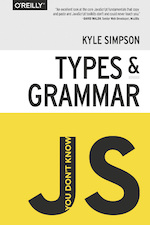
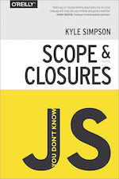
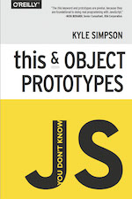
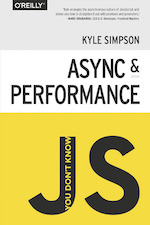

# You Don't Know JS 정리

|타입과 문법|스코프와 클로저|this와 객체 프로토타입|비동기와 성능|
|:-:|:-:|:-:|:-:|
||||

---

### [Part 1. 타입과 문법(작업중...)](./part1/README.md)

### [Part 2. 스코프와 클로저](./part2/README.md)

### Part 3. this와 객체 프로토타입

### [Part 4. 비동기와 성능(작업중...)](./part4/README.md)
