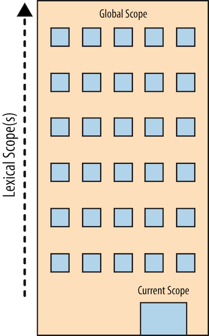

## 1. 스코프란 무엇인가

> 변수는 어디에 살아있는가? 다른 말로 하면 변수는 어디에 저장되는가?

> 필요할 때 프로그램은 어떻게 변수를 찾는가?

### 1.1 컴파일러 이론

자바스크립트는 일반적으로 '동적' 또는 '인터프리터' 언어로 분류하나 사실은 '컴파일러 언어'다.

자바스크립트는 코드가 실행되기 바로 직전에 컴파일된다.

그래서 기존 컴파일러와 다르게 최적화할 시간이 많지 않다.

**토크나이징<sup>Tokenizing</sup>/렉싱<sup>Lexing</sup>**

문자열을 나누어 '토큰<sup>Token</sup>'이라 불리는 (해당 언어에) 의미 있는 조각으로 만드는 과정

**파싱<sup>Parsing</sup>**

토큰 배열을 프로그램의 문법 구조를 반영하여 중첩 원소를 갖는 트리 형태로 바꾸는 과정

파싱의 결과로 만들어진 트리를 AST<sup>Abstract Syntax Tree</sup>(추상 구문 트리)라 부른다.

**코드 생성<sup>Parsing</sup>**

AST를 컴퓨터에서 실행 코드로 바꾸는 과정

언어에 따라 또는 목표하는 플랫폼에 따라 크게 달라진다.

### 1.2 스코프 이해하기

#### 1.2.1 출연진

- `엔진` 컴파일레이션의 시작부터 끝까지 전 과정과 자바스크립트 프로그램 실행을 책임진다.
- `컴파일러` 엔진의 친구로, 파싱과 코드 생성의 모든 잡일을 도맡아 한다.
- `스코프` 엔진의 또 다른 친구로, 선언된 모든 확인자(변수) 검색 목록을 작성하고 유지한다. 또한 엄격한 규칙을 강제하여 현재 실행 코드에서 확인자의 적용 방식을 정한다.

#### 1.2.2 앞과 뒤

``` javascript
var a = 2;
```

하나의 구문이지만

1. 컴파일러가 컴파일레이션 과정에서 처리할 구문
2. 실행 과정에서 엔진이 처리할 구문

으로 나뉜다.

컴파일러와 엔진이 위 구문을 처리하는 과정

1. 컴파일러가 변수를 선언
2. 엔진이 스코프에서 변수를 찾고 변수가 있다면 값을 대입

#### 1.2.3 컴파일러체<sup>Compiler Speak</sup>

**LHS 검색(참조)**

변수가 대입 연산자의 왼쪽에 있을 때 수행

값을 넣어야 하므로 변수 컨테이너 자체를 찾는다.


**RHS 검색(참조)**

변수가 대입 연산자의 오른쪽에 있을 때 수행

좀더 정확히 말하면 '왼편이 아닌 쪽'에 가깝다.

단순히 특정 변수의 값을 찾는 것

``` javascript
// 구문에서 a에 아무것도 대입하지 않으므로
// a에 대한 RHS 참조
console.log(a);

// 현재 a 값을 신경 쓸 필요 없이 '= 2' 대입 연산을 수행할 대상 변수를 찾으므로
// a에 대한 LHS 참조
a = 2;
```

#### 1.2.4 엔진과 스코프의 대화

``` javascript
function foo(a) {
    console.log(a); // 2
}

foo(2);
```

> 엔진: 안녕, 스코프. foo에 대한 RHS 참조가 필요해. foo라고 들어본 적 있니?

> 스코프: 응, 들어봤어. 컴파일러가 좀 전에 선언하더라고. foo는 함수야. 이걸 보면 돼.
  
> 엔진: 좋아. 고마워! 자, 이제 나는 foo를 실행해야겠어.

> 엔진: 이봐, 스코프. a에 대한 LHS 참조도 구해야 하는데, 들어본 적 있어?

> 스코프: 물론이지. 컴파일러가 a를 foo의 인자로 좀 전에 선언했어. 이걸 봐.

> 엔진: 항상 도와줘서 고마워, 스코프. 정말 고마워. 이제 2를 a에 대입할 시간이야.

> 엔진: 스코프, 자꾸 귀찮게 해서 미안해. console에 대한 RHS 검색이 필요해. 해줄 수 있겠니?

> 스코프: 문제없어, 엔진. 이게 내가 항상 하는 일이잖니. 자, console을 찾았어. 내장되어 있더라. 이거야.

> 엔진: 완벽해. 이제 log()를 찾아볼까. 좋아 멋져. 이건 함수구나.

> 엔진: 요~ 스코프! a의 RHS 참조 찾는 것 좀 도와줄 수 있을까? 나한테도 있긴 할 테지만, 확실히 해두고 싶어.

> 스코프: 옳은 말이야, 엔진. 변함없이 엄밀하구나. 여기 있어.

> 엔진: 멋져. 이제 a의 값을... 값은 2구나 log()에 넘기자.
  
> ...

#### 1.2.5 퀴즈

``` javascript
1 function foo(a) {
2     var b = a;
3     return a + b;
4 }
5 
6 var c = foo(2);
```

1. 모든 LHS 검색을 찾아보라.(모두 3개)
2. 모든 RHS 검색을 찾아보라.(모두 4개)

정답

1. line 6: foo() RHS 검색 👉 `foo(2 ...`
2. line 1: a LHS 검색 👉 `a = 2(암시적 인자대입)`
3. line 2: b LHS 검색 👉 `b = ...`
4. line 2: a RHS 검색 👉 `= a`
5. line 3: a RHS 검색 👉 `a ...`
6. line 3: b RHS 검색 👉 `... b`
7. line 6: c LHS 검색 👉 `c = ...`

### 1.3 중첩 스코프

`스코프`는 확인자 이름으로 변수를 찾기 위한 규칙의 집합

하나의 블록이나 함수는 다른 블록이나 함수 안에 중첩될 수 있으므로 스코프도 다른 스코프 안에 중첩<sup>Nested</sup>될 수 있다.

대상 변수를 현재 스코프에서 발견하지 못하면 엔진은 다음 바깥의 스코프로 넘어가는 식으로, 글로벌 스코프라 부르는 가장 바깥 스코프에 도달할 때까지 계속한다.

``` javascript
function foo(a) {
    console.log(a + b);
}

var b = 2;
foo(2); // 4
```

> 엔진: 이봐, foo의 스코프, b에 대해 들어본 적 있니? b에 대한 RHS 참조가 필요한데 말이야.

> foo의 스코프: 아니, 못 들어봤어. 딴 데 가봐.

> 엔진: 이봐, foo의 바깥 스코프! 아, 네가 글로벌 스코프구나, 멋지군. 혹시 b에 대해 들어봤니? b에 대한 RHS 참조가 필요해.

> 글로벌 스코프: 응, 물론 들어봤지. 여기 있어.

중첩 스코프의 간단한 규칙

- 엔진은 현재 스코프에서 변수를 찾기 시작하고, 찾지 못하면 한 단계씩 올라간다.
- 최상위 글로벌 스코프에 도달하면 변수를 찾았든, 못 찾았든 검색을 멈춘다.

#### 1.3.1 비유료 배워보기



### 1.4 오류

**Q:** LHS와 RHS를 구분하는 것이 왜 중요할까?

**A:** 두 종류의 검색 방식은 변수가 아직 선언되지 않았을 때(검색한 모든 스코프에서 찾지 못했을 때) 서로 다르게 동작하기 때문이다.

``` javascript
function foo(a) {
    console.log(a + b); // // ReferenceError: DEBUG is not defined
}

foo(2);
```

b에 대한 RHS 검색이 중첩 스코프 안 어디에서도 변수를 찾지 못하면 엔진이 `ReferenceError`를 발생시킨다.

엔진이 LHS 검색을 수행하여 변수를 찾지 못하고 최상위 층(글로벌 스코프)에 도착했을 때,

- **Strict Mode인 경우:** RHS의 경우와 같이 `ReferenceError`를 발생시킨다.
- **Strict Mode가 아닌 경우:** 글로벌 스코프는 엔진이 검색하는 이름을 가진 새로운 변수를 생성해서 엔진에게 넘겨준다.

RHS 검색 결과 변수를 찾았지만 그 값을 가지고 불가능한 일을 하려고 할 경우(예: 함수가 아닌 값을 함수처럼 실행하거나 null 이나 undefined 값을 참조) 엔진은 `TypeError`를 발생시킨다.

- `ReferenceError` 스코프에서 대상을 찾지 못한 경우
- `TypeError` 스코프 검색은 성공했으나 결괏값을 가지고 적합하지 않거나 불가능한 시도를 한 경우
