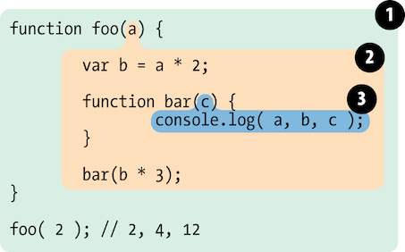

## 2. 렉시컬 스코프

### 2.1 렉스 타임

렉시컬 스코프는 렉싱 타임<sup>Lexing Time</sup>에 정의되는 스코프다.

렉시컬 스코프는 프로그래머가 코드를 짤 때 변수와 스코프 블록을 어디서 작성하는가에 기초해서 렉서<sup>lexer</sup>가 코드를 처리할 때 확정된다.

``` javascript
function foo(a) {
    var b = a * 2;

    function bar(c) {
        console.log(a, b, c);
    }

    bar(b * 3);
}

foo(2); // 2, 4, 12
```



- `버블1` 글로벌 스코프를 감싸고 있고, 포함된 확인자<sup>Identifier</sup>는 foo 1개
- `버블2` foo 스코프를 감싸고 있고, 포함된 확인자는 a, b, bar 3개
- `버블3` bar 스코프를 감싸고 있고, 포함된 확인자는 c 1개

`bar`의 버블은 `foo`의 버블 내부에 완전히 포함된다.

어떤 함수의 버블도 동시에 다른 두 스코프 버블 안에 존재할 수 없다.

어떤 함수도 두 개의 부모 함수 안에 존재할 수 없다.

#### 2.1.1 검색

``` javascript
// 3개의 참조된 변수 a, b, c를 검색한다.
console.log(a, b, c);
```

순서

1. `bar()` 함수 스코프에서 `a` 검색 -> 없음
2. `foo()` 함수 스코프에서 `a` 검색 -> 찾음
3. 글로벌 스코프에 `a`가 있다고 하더라도 검색 중지

b, c 동일

스코프는 목표와 일치하는 대상을 찾는 즉시 검색을 중단한다.

여러 중첩 스코프에서 같은 확인자 이름을 정의할 수 있다.

`섀도잉`<sup>shadowing</sup> 더 안쪽은 확인자가 더 바깥족의 확인자를 가리는 것.

어떤 함수가 어디서 또는 어떻게 호출되는지에 상관없이 함수의 렉시컬 스코프는 **함수가 선언된 위치**에 따라 정의된다.

렉시컬 스코프 검색 과정은 a, b, c와 같은 1차 확인자 검색에만 사용한다. 코드에서 foo.bar.baz의 참조를 찾는다고 하면, foo를 찾고 나서는 객체 속성 접근 규칙을 통해서 bar와 baz의 속성을 각각 가져온다.

### 2.2 렉시컬 속이기

자바스크립트에서는 렉시컬 스코프를 속일 수(런타임에서 수정) 있는 두 가지 방법이 있다.

둘다 비추 & 성능 저하

#### 2.2.1 eval

자세한 설명은 생략한다.

#### 2.2.2 with

자세한 설명은 생략한다.

#### 2.2.3 성능

자바스크립트 엔진은 컴파일레이션 단계에서 상당수의 최적화 작업을 진행한다.

`eval()`이나 `with`가 코드에 있다면 대다수 최적화가 의미 없어져서 아무런 최적화도 하지 않은 것이나 마찬가지가 되어버린다.

거의 확실히 더 느리게 동작할 것이다.
